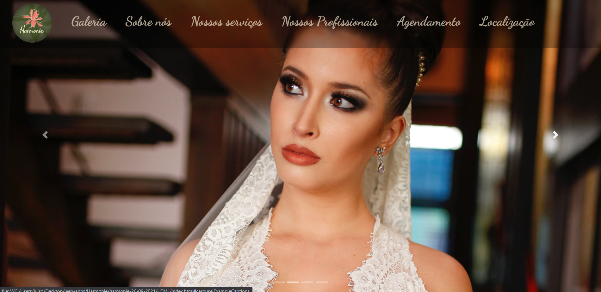
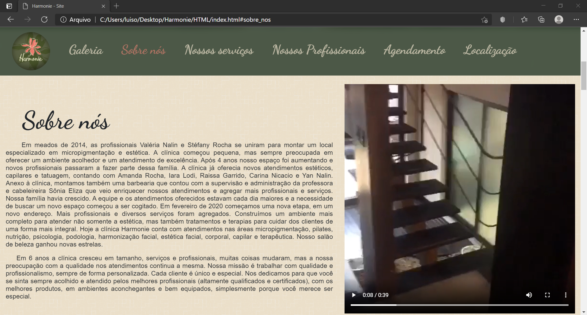
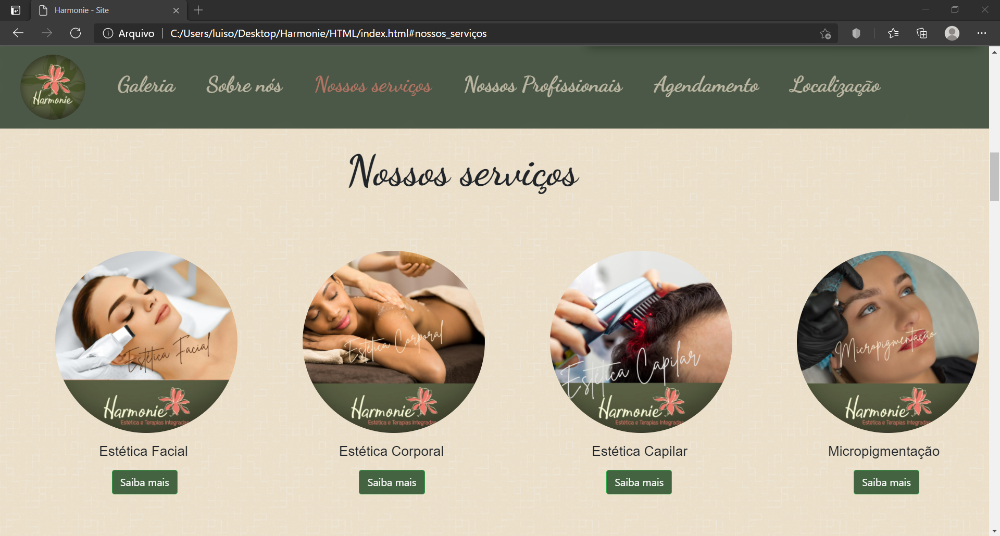
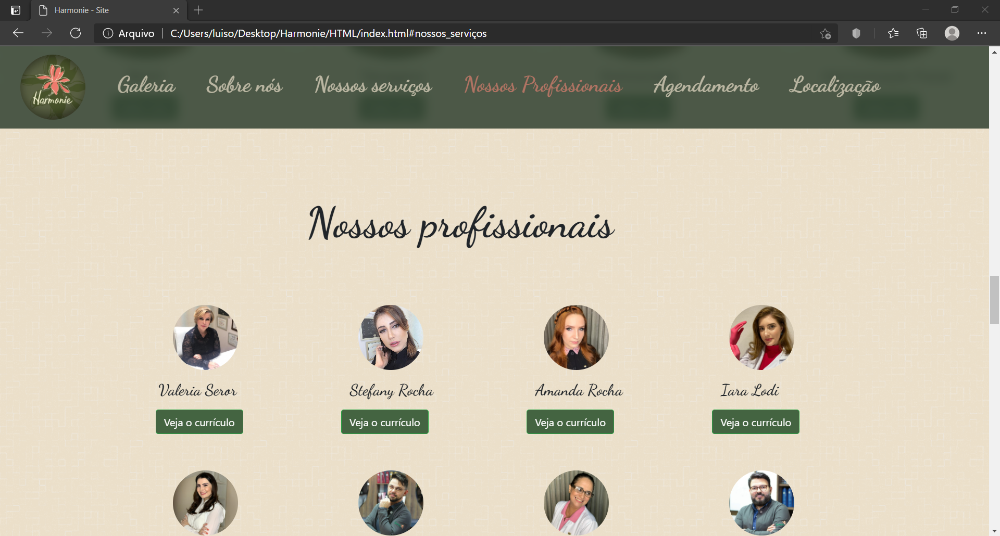
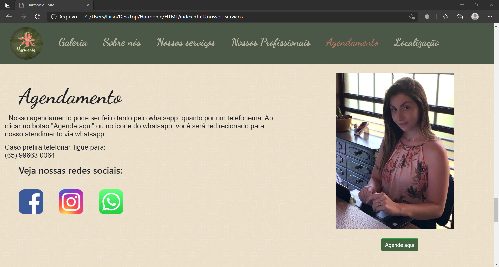
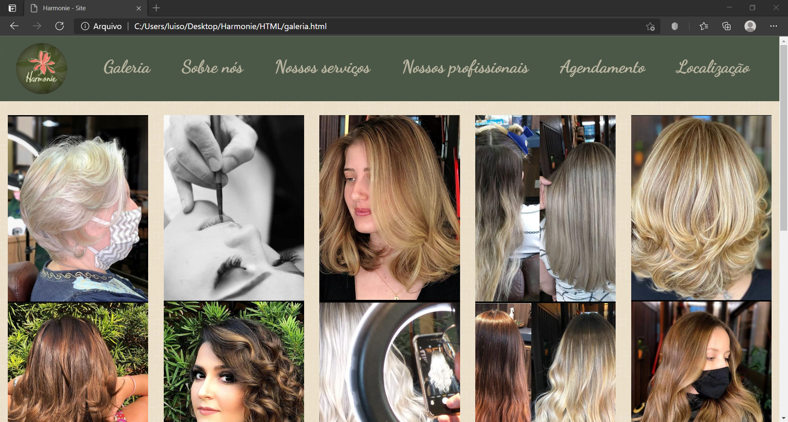

 

# Hamonie-Web-Site 

 

**The Web-site of the Harmonie esthetics clinic**

## Features:

### Initial carousel

### About us

 

### Clinic main services

 ### Clinic professional's info:
 

 

### Apointment system using whats-aap API:

### A galery: 

### and also a location system using google maps API 

## See for youself at [harmonie Web-site](http://harmonieesteticaemicropigmentacao.com)

## Additional info

**This was the first Web-site I made.
 
It was made by me alone Luis Octavio Galesso Seror, using only pure HTML, CSS, JS, Jquery and bootstrap. Whitout any angular or react like framework's to increase performance**

**this code its a little messy but it was my first web-site**

